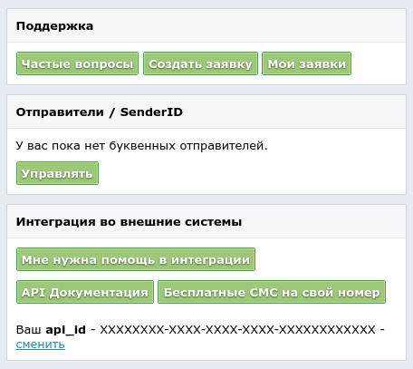

# AnySMS sms.ru backend

[](https://travis-ci.org/Fedcomp/any_sms-backend-smsru)
[](https://badge.fury.io/rb/any_sms-backend-smsru)

backend for [AnySMS](https://github.com/Fedcomp/any_sms) to work with [sms.ru](https://sms.ru)

## Installation and usage

Add this line to your application's Gemfile:

```ruby
gem "any_sms"
gem "any_sms-backend-smsru"
```

Then somewhere in your initialization code:

```ruby
require "any_sms"

AnySMS.configure do |c|
  c.register_backend :my_main_backend,
                     AnySMS::Backend::Smsru,
                     api_id: ENV["SMSRU_TOKEN"]

  c.default_backend = :my_main_backend
end
```

Now, whenever you need to send SMS, just do:

```ruby
phone = "799999999"
text = "My sms text"

# Should actually send sms
AnySMS.send_sms("79999999999", "text")
```

For more advanced usage please
go to [AnySMS documentation](https://github.com/Fedcomp/any_sms#real-life-example)

**Don't forget**, you need to put real *api_id* in SMSRU_TOKEN environment variable.
In bash you would do it like that:
```bash
export SMSRU_TOKEN "XXXXXXXX-XXXX-XXXX-XXXX-XXXXXXXXXXXX"
```
Read below how to receive own token to work with sms.ru.

# Receiving api_id from sms.ru

First of all, you should register on https://sms.ru/ .
Then, when you are registered, make sure you have
some small amount of balance to actually send sms.
On your main page (when you are logged)
you should see:



instead of XXXXXXXX-XXXX-XXXX-XXXX-XXXXXXXXXXXX you should see your actual api_id key.

## Contributing

Bug reports and pull requests are welcome on GitHub
at https://github.com/Fedcomp/any_sms-backend-smsru

## License

The gem is available as open source under the terms of the [MIT License](http://opensource.org/licenses/MIT).
